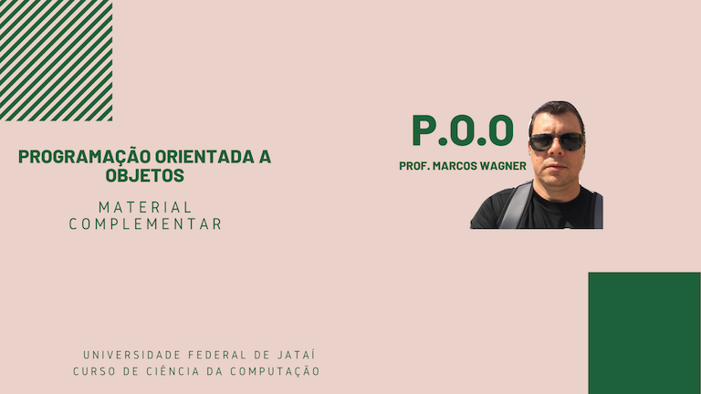

# Aula 11 - Programação Orientada a Objetos

> Aula 25/11/2021
> 
>  * Orientação a Objetos - Interfaces Gráficas. *

## Atividades da aula - roteiro
- Abstração
- Classes
- Objetos
- Herança

## Exemplo de Aplicação 

### Conteúdo
- [Conceitos de Programação Orientada a Objetos](Conteudo_POO.pdf)

### Passo 1: Criação da aplicação
- [x]  Criar um Projeto
- [x]  Criar a classe 
- [x]  Atributos - Métodos
- [x]  Construtores
- [x]  Gets/Sets/ToString
- [x]  Enviar para o GitHub (interfaces1) 

####  Os vídeos abaixo mostram a implementação do programa

🥇:
-
🥈:
-
🥉:

