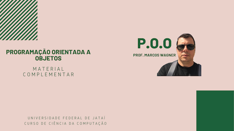

# Aula 14 - Programação Orientada a Objetos

> Aula 07/12/2021
> 
>  * Orientação a Objetos - Interfaces Gráficas. *

## Atividades da aula - roteiro
- Abstração
- Classes
- Objetos
- Herança
- Componentes Gráficos (Cadastro Completo - Uso de um ORM)

## Exemplo de Aplicação 

### Conteúdo
- [Conceitos de Programação Orientada a Objetos](Conteudo_POO.pdf)
- [Conceitos de Desenvolvimento de Aplicações](https://github.com/marcoswagner-commits/gestao_obras_aula_daw/blob/c538408f813e12bb046aeddaf8ae0d15d8277fff/documentos/Conte%C3%BAdo_Aula_DSW_M%C3%B3dulo_I.pdf)

### Passo 1: Aplicação Completa (FullApp)
- [x]  Conceito => CRUD - Create / Retrieve / Update / Delete
- [ ]  Conceito => Data Source (Base de Dados)
- [ ]  Camada => DAO - Data Access Object
- [ ]  Especificação => JPA (Java Persistence Application)
- [ ]  Conceito => ORM (Object-Relational Mapping)  
- [ ]  Criar uma Base de Dados - Database (ConClientes)
- [ ]  Criar uma Tabela - Table (cliente)
- [ ]  Criar uma estrutura de persistência usando a IDE NetBeans (Entity Class for DataBase)
- [ ]  Estruturar o projeto em pastas (DAO - MODEL - VIEW - EXCEPTIONS)
- [x]  Enviar para o GitHub (ConClientes) 

####  Os vídeos abaixo mostram a implementação do programa

🥇:
-
🥈:
-
🥈:

